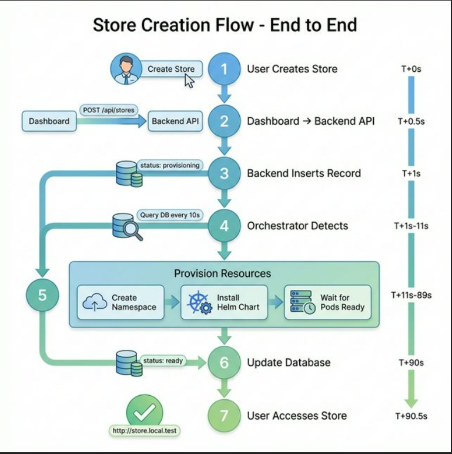
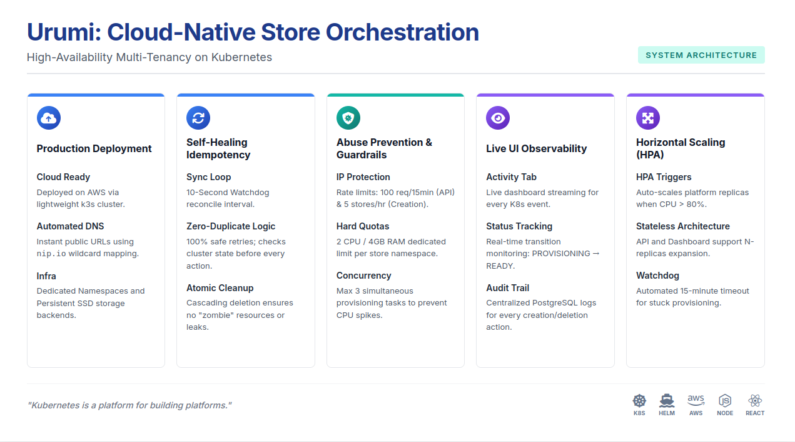

# 🚀 Store Orchestrator - Kubernetes E-commerce Provisioning Platform

A production-ready, multi-tenant SaaS platform that automatically provisions isolated e-commerce stores (WooCommerce/MedusaJS) on Kubernetes. Deploy locally with Kind or in production with k3s using the same Helm charts.


## 📋 Table of Contents

- [Features](#-features)
- [Architecture](#-architecture)
- [Quick Start (Local)](#-quick-start-local)
- [Production Deployment](#-production-deployment)
- [Usage](#-usage)
- [Development](#-development)
- [Project Structure](#-project-structure)
- [Configuration](#-configuration)
- [Troubleshooting](#-troubleshooting)

## This is how it works:





## ✨ Features

### Core Capabilities
- **Multi-Engine Support**: WooCommerce (WordPress + MySQL) and MedusaJS (Node.js + PostgreSQL + Redis)
- **One-Click Provisioning**: Automated deployment of complete e-commerce stacks
- **Namespace Isolation**: Each store runs in its own Kubernetes namespace with ResourceQuotas
- **Beautiful Dashboard**: Modern React UI with real-time status updates
- **Idempotent Operations**: Safe retry logic for provisioning and cleanup
- **Production-Ready**: Same Helm charts work locally and in production

### Advanced Features
- **Resource Quotas**: Per-store CPU/memory limits to prevent resource exhaustion
- **Health Monitoring**: Readiness/liveness probes for all components
- **Audit Logging**: Track who created/deleted what and when
- **Clean Teardown**: Complete resource cleanup on store deletion
- **Auto-Refresh**: Dashboard polls every 5 seconds for status updates
- **Error Reporting**: Clear error messages when provisioning fails

## 🏗️ Architecture

```
┌─────────────────────────────────────────────────────────────┐
│                     Platform Layer                          │
│  ┌──────────┐  ┌──────────┐  ┌─────────────┐  ┌──────────┐│
│  │Dashboard │→ │ Backend  │→ │Orchestrator │→ │PostgreSQL││
│  │ (React)  │  │   API    │  │(Controller) │  │          ││
│  └──────────┘  └──────────┘  └─────────────┘  └──────────┘│
└─────────────────────────────────────────────────────────────┘
                              ↓
┌─────────────────────────────────────────────────────────────┐
│                     Store Layer (Tenants)                   │
│  ┌────────────────────┐      ┌────────────────────┐        │
│  │ Namespace: store-1 │      │ Namespace: store-2 │        │
│  │ ┌────────────────┐ │      │ ┌────────────────┐ │        │
│  │ │  WooCommerce   │ │      │ │    MedusaJS    │ │        │
│  │ │  + WordPress   │ │      │ │  + Storefront  │ │        │
│  │ │  + MySQL       │ │      │ │  + PostgreSQL  │ │        │
│  │ └────────────────┘ │      │ │  + Redis       │ │        │
│  └────────────────────┘      │ └────────────────┘ │        │
│                               └────────────────────┘        │
└─────────────────────────────────────────────────────────────┘
```

### Component Responsibilities

| Component | Technology | Purpose |
|-----------|-----------|---------|
| **Dashboard** | React + Vite | User interface for store management |
| **Backend API** | Node.js + Express | REST API for CRUD operations |
| **Orchestrator** | Node.js + K8s Client | Reconciliation loop for provisioning |
| **PostgreSQL** | PostgreSQL 15 | Store metadata and audit logs |
| **Helm Charts** | Helm 3 | Package and deploy stores |
| **Ingress** | nginx-ingress | HTTP routing to stores |

## 🚀 Quick Start

### Prerequisites

- **Docker** (for Kind)
- **kubectl** 1.27+
- **Helm** 3.12+
- **Node.js** 20+
- **8GB+ RAM** recommended

### 1. Setup Kubernetes Cluster

```bash
# Clone the repository
git clone <your-repo>
cd urumi

# Run automated setup (installs Kind, nginx-ingress, PostgreSQL)
./scripts/setup-local.sh
```

This script will:
- Create a Kind cluster with ingress support
- Install nginx-ingress controller
- Deploy PostgreSQL in the `platform` namespace
- Configure local DNS (*.local.dev → 127.0.0.1)

### 2. Install Dependencies

```bash
# Backend
cd backend
npm install
cp .env.example .env

# Orchestrator
cd ../orchestrator
npm install

# Dashboard
cd ../dashboard
npm install
```

### 3. Configure Environment

Edit `backend/.env`:

```env
DB_HOST=postgres-postgresql.platform.svc.cluster.local
DB_PORT=5432
DB_NAME=orchestrator
DB_USER=postgres
DB_PASSWORD=postgres
PORT=3000
```

For orchestrator, create `orchestrator/.env`:

```env
DB_HOST=postgres-postgresql.platform.svc.cluster.local
DB_PORT=5432
DB_NAME=orchestrator
DB_USER=postgres
DB_PASSWORD=postgres
DOMAIN=local.dev
WOOCOMMERCE_CHART_PATH=./helm/store-templates/woocommerce
MEDUSA_CHART_PATH=./helm/store-templates/medusa
```

### 4. Run Platform Components

Open 3 terminals:

```bash
# Terminal 1: Backend API
cd backend
npm start
# ✅ Backend API running on port 3000

# Terminal 2: Orchestrator
cd orchestrator
npm start
# ✅ Orchestrator starting reconciliation loop

# Terminal 3: Dashboard
cd dashboard
npm run dev
# ✅ Dashboard running on http://localhost:5173
```

### 5. Access Dashboard

Open your browser: **http://localhost:5173**

You should see the Store Orchestrator dashboard!

## 📖 Usage

### Creating a Store

1. Click **"Create New Store"**
2. Enter a store name (e.g., `my-shop`)
3. Select store type: **WooCommerce** or **MedusaJS**
4. Click **"Create Store"**
5. Wait 3-5 minutes for provisioning (status will show "PROVISIONING" → "READY")

### Accessing Your Store

Once status is **READY**:
- Click **"Open Store"** button
- Store URL: `http://my-shop.local.dev`
- WooCommerce admin: `http://my-shop.local.dev/wp-admin`

### Placing a Test Order (WooCommerce)

1. Open store URL
2. WordPress setup wizard will appear (first time only):
   - Language: English
   - Site Title: "My Shop"
   - Username: `admin`
   - Password: (choose a strong password)
   - Email: your@email.com
3. Install WooCommerce plugin:
   - Go to Plugins → Add New
   - Search "WooCommerce"
   - Install & Activate
4. WooCommerce setup wizard:
   - Skip store details (or fill them)
   - Skip payment gateways (or enable "Cash on Delivery")
   - Create a sample product
5. Visit storefront and place an order:
   - Add product to cart
   - Checkout
   - Select "Cash on Delivery"
   - Place order
6. Verify order in admin: WooCommerce → Orders

### Deleting a Store

1. Click **"Delete"** button on store card
2. Confirm deletion
3. Orchestrator will:
   - Uninstall Helm release
   - Delete namespace (cascades to all resources)
   - Remove database entry

## 🌐 Production Deployment

### Prerequisites

- VPS with 4GB+ RAM (DigitalOcean, Hetzner, Linode, AWS)
- Ubuntu 22.04
- Domain name with DNS access
- Public IP address

### 1. Install k3s

```bash
# SSH into your VPS
ssh root@your-vps-ip

# Install k3s
curl -sfL https://get.k3s.io | sh -

# Verify installation
kubectl get nodes
```

### 2. Configure DNS

Add wildcard DNS record:

```
Type: A
Name: *
Value: YOUR_VPS_IP
TTL: 300
```

This allows `*.yourdomain.com` to point to your VPS.

### 3. Install cert-manager (TLS)

```bash
kubectl apply -f https://github.com/cert-manager/cert-manager/releases/download/v1.13.0/cert-manager.yaml

# Wait for cert-manager to be ready
kubectl wait --for=condition=ready pod -l app.kubernetes.io/instance=cert-manager -n cert-manager --timeout=300s
```

Create ClusterIssuer:

```bash
cat <<EOF | kubectl apply -f -
apiVersion: cert-manager.io/v1
kind: ClusterIssuer
metadata:
  name: letsencrypt-prod
spec:
  acme:
    server: https://acme-v02.api.letsencrypt.org/directory
    email: your-email@example.com
    privateKeySecretRef:
      name: letsencrypt-prod
    solvers:
    - http01:
        ingress:
          class: nginx
EOF
```

### 4. Build and Push Docker Images

```bash
# On your local machine
docker build -t yourregistry/store-backend:v1 ./backend
docker build -t yourregistry/store-orchestrator:v1 ./orchestrator
docker build -t yourregistry/store-dashboard:v1 ./dashboard

docker push yourregistry/store-backend:v1
docker push yourregistry/store-orchestrator:v1
docker push yourregistry/store-dashboard:v1
```

### 5. Deploy Platform with Helm

```bash
# Install PostgreSQL
helm repo add bitnami https://charts.bitnami.com/bitnami
helm install postgres bitnami/postgresql \
  --namespace platform \
  --create-namespace \
  --set auth.username=postgres \
  --set auth.password=CHANGE_THIS_PASSWORD \
  --set auth.database=orchestrator

# Deploy platform (create Helm chart first - see helm/platform/)
helm install platform ./helm/platform \
  --namespace platform \
  --set domain=yourdomain.com \
  --set ingress.tls.enabled=true \
  --set image.registry=yourregistry \
  --set image.tag=v1
```

### 6. Access Production Dashboard

Visit: **https://dashboard.yourdomain.com**

## 🛠️ Development

### Project Structure

```
urumi/
├── backend/              # Node.js REST API
│   ├── src/
│   │   ├── server.js     # Express server
│   │   ├── db/           # PostgreSQL connection
│   │   ├── models/       # Data models
│   │   ├── controllers/  # Request handlers
│   │   └── routes/       # API routes
│   └── Dockerfile
│
├── orchestrator/         # Kubernetes controller
│   ├── src/
│   │   ├── controller.js # Reconciliation loop
│   │   ├── provisioners/ # WooCommerce/Medusa logic
│   │   └── k8s/          # Kubernetes client
│   └── Dockerfile
│
├── dashboard/            # React frontend
│   ├── src/
│   │   ├── App.jsx       # Main component
│   │   ├── components/   # UI components
│   │   ├── hooks/        # React hooks
│   │   └── services/     # API client
│   └── vite.config.js
│
├── helm/                 # Helm charts
│   ├── platform/         # Platform chart
│   └── store-templates/  # Store charts
│       ├── woocommerce/
│       └── medusa/
│
└── scripts/              # Setup scripts
    └── setup-local.sh
```

### API Endpoints

| Method | Endpoint | Description |
|--------|----------|-------------|
| GET | `/api/stores` | List all stores |
| POST | `/api/stores` | Create new store |
| GET | `/api/stores/:id` | Get store details |
| DELETE | `/api/stores/:id` | Delete store |
| GET | `/api/health` | Health check |

### Database Schema

```sql
-- Stores table
CREATE TABLE stores (
    id UUID PRIMARY KEY,
    name VARCHAR(255) NOT NULL,
    type VARCHAR(50) NOT NULL,
    status VARCHAR(50) NOT NULL,
    namespace VARCHAR(255) UNIQUE NOT NULL,
    url VARCHAR(255),
    helm_release VARCHAR(255),
    created_at TIMESTAMP DEFAULT NOW(),
    updated_at TIMESTAMP DEFAULT NOW(),
    error_message TEXT
);

-- Audit logs table
CREATE TABLE audit_logs (
    id SERIAL PRIMARY KEY,
    user_id VARCHAR(255),
    action VARCHAR(50) NOT NULL,
    store_id UUID,
    timestamp TIMESTAMP DEFAULT NOW(),
    ip_address VARCHAR(45),
    details JSONB
);
```

## ⚙️ Configuration

### Helm Values (Local vs Production)

**Local (`values-local.yaml`)**:
```yaml
domain: local.dev
ingress:
  tls: false
storage:
  storageClass: standard
resources:
  backend:
    limits:
      cpu: 500m
      memory: 512Mi
```

**Production (`values-prod.yaml`)**:
```yaml
domain: yourdomain.com
ingress:
  tls: true
  certManager: true
storage:
  storageClass: local-path
resources:
  backend:
    limits:
      cpu: 2000m
      memory: 2Gi
```

### Resource Quotas (Per Store)

```yaml
requests.cpu: "2"
requests.memory: 4Gi
limits.cpu: "4"
limits.memory: 8Gi
persistentvolumeclaims: "3"
```

## 🔧 Troubleshooting

### Store stuck in "PROVISIONING"

```bash
# Check orchestrator logs
kubectl logs -n platform deployment/orchestrator

# Check store namespace
kubectl get pods -n store-<name>

# Check Helm release
helm list -n store-<name>
```

### Cannot access store URL

```bash
# Check ingress
kubectl get ingress -A

# Check /etc/hosts (local)
cat /etc/hosts | grep local.dev

# Check DNS (production)
nslookup yourstore.yourdomain.com
```

### PostgreSQL connection failed

```bash
# Check PostgreSQL pod
kubectl get pods -n platform

# Port-forward to PostgreSQL
kubectl port-forward -n platform svc/postgres-postgresql 5432:5432

# Test connection
psql -h localhost -U postgres -d orchestrator
```

### Helm install failed

```bash
# Check Helm release status
helm status <release-name> -n <namespace>

# View Helm history
helm history <release-name> -n <namespace>

# Rollback if needed
helm rollback <release-name> -n <namespace>
```

## 📊 Monitoring

### Check Platform Health

```bash
# Backend API
curl http://localhost:3000/api/health

# Kubernetes resources
kubectl get all -n platform

# Store namespaces
kubectl get namespaces | grep store-
```

### View Logs

```bash
# Backend logs
kubectl logs -n platform deployment/backend -f

# Orchestrator logs
kubectl logs -n platform deployment/orchestrator -f

# Store logs (WordPress example)
kubectl logs -n store-<name> deployment/wordpress -f
```

## 🎯 Roadmap

- [ ] Multi-user authentication (OAuth2)
- [ ] Store templates (pre-configured themes/plugins)
- [ ] Backup/restore functionality
- [ ] Horizontal scaling for orchestrator
- [ ] Prometheus metrics
- [ ] Grafana dashboards
- [ ] NetworkPolicies for store isolation
- [ ] Custom domain support per store

## 📝 License

MIT

## 🤝 Contributing

Contributions welcome! Please open an issue or PR.

---

**Built with ❤️ using Kubernetes, Helm, React, and Node.js**
